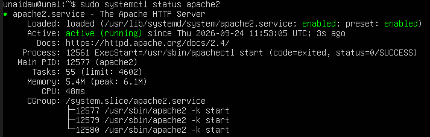
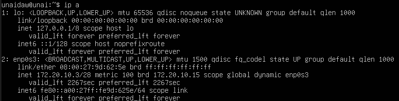

# Instalación de Apache en Ubuntu Server

## 1.Instalamos apache
sudo apt install apache2 -y

## 2. Comprobamos el apache
sudo systemctl status apache2

## 3. Consultar la ip del servidor 
ip a

## 4. Comprobar Apache
Desde el host en el navegador ponemos la IP del servidor 

